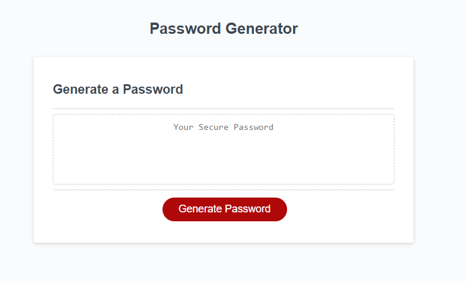

# [Password-Generator](https://bcbridges.github.io/Password-Generator/) Website

## Description of Project

This password generator was designed to practice JavaScript programming by taking in multiple types of user input and outputting a single string based on the input.

### script.js

- Created three functions: two to take in user input and one to calculate the output password.
- One error in the logic noted by the developer is that the selected criteria is included in the password's potential values, but each type of criteria is not guaranteed to be in the password.

## Installation and Access

There is no required software installation necessary to access the code or GitHub published webpage. To access the webpage, either click the 'Password-Generator' link at the top of this readme or go to this link https://bcbridges.github.io/Password-Generator/.

To access the user interface funcitonality of the program, click on the red "Generate Password" button (Image 1). You will then be prompted for password length and criteria that you would like to include in your password.

### Image 1

The script.js can be accessed [here](./assets/script.js).

## License

Copyright (C) 2021 Brice Bridges - the full license can be viewed [here](license.txt)
